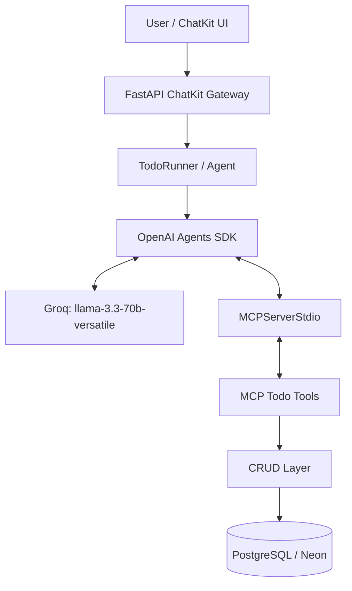
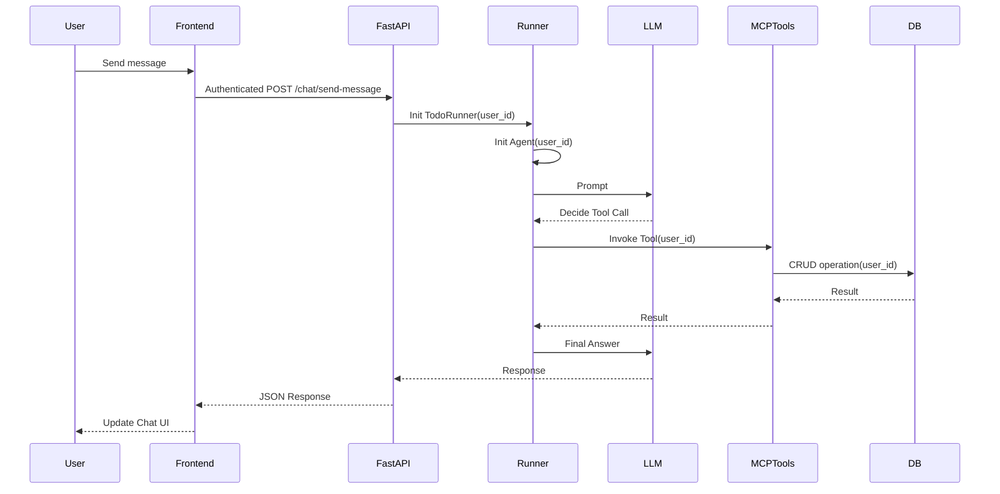
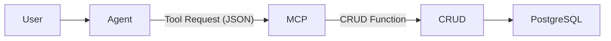
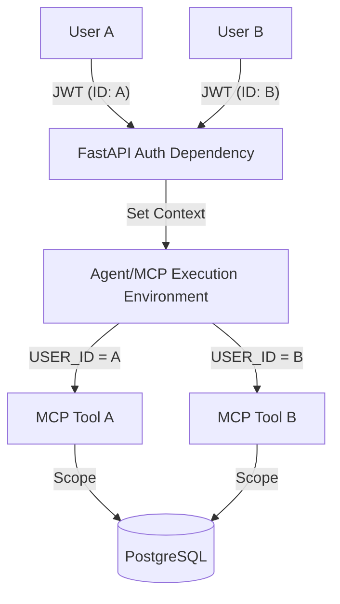

# 🤖 Todo AI Chatbot: Hackathon II (Phase III)

> **"Transforming your productivity with conversational AI, orchestrated by MCP agents."**


---

## 📖 Project Overview

**Phase III: Todo AI Chatbot** is a collaborative project for Hackathon II, designed to evolve a traditional task management application into an intelligent, conversational system. By integrating an **AI-powered agent** with the **Model Context Protocol (MCP)**, this application allows users to manipulate their task list using natural language—enabling creation, listing, updating, completion, and deletion of todos without ever interacting with a standard CRUD interface directly.

### What is Phase III?
Phase III shifts the paradigm from UI-driven input to intent-driven interaction. It introduces an intelligent **Agent** that acts as a bridge between the user's natural language and the backend CRUD logic through standard MCP tools, maintaining strict **authenticated user isolation** throughout the entire process.

---

## 💡 The Problem & Solution

### The Problem
Traditional Todo applications rely on repetitive manual UI actions (clicking, typing, selecting dropdowns). As task lists grow, managing them becomes cognitively demanding and inefficient.

### The Solution
A **Conversational AI Chatbot** powered by `llama-3.3-70b-versatile` (via Groq). The AI understands the context, handles ambiguity, and uses precise tool-calling to interact with the database on the user's behalf.

### Why an AI Todo Application?
- **Cognitive Reduction:** Don't think about *how* to manage tasks; just say what needs to be done.
- **Context Awareness:** The AI remembers past tasks, making interactions fluid (e.g., "Complete *that* task I just added").
- **Reliability:** By using MCP (Model Context Protocol), we ensure that the AI interacts with your data through strictly defined, versioned tools, not just raw SQL or brittle prompts.

---

## ✨ Core Features & AI Capabilities

### Todo Operations
Our Agent is equipped with five foundational MCP tools:
- ✅ **`add_task`**: Create new items with descriptions and due dates.
- 📋 **`list_tasks`**: Retrieve your current backlog.
- ✏️ **`update_task`**: Modify existing tasks.
- 🎯 **`complete_task`**: Mark items as done.
- 🗑️ **`delete_task`**: Remove items.

### Example Conversations
> **User:** "Add a task called Buy groceries"
> **Assistant:** "Done! I've created a task for you: 'Buy groceries'."

> **User:** "Show my tasks"
> **Assistant:** "Here are your pending tasks:\n1. Buy groceries (Pending)"

> **User:** "Complete the task Buy groceries"
> **Assistant:** "Done! I've marked 'Buy groceries' as complete."

---

## 🏗️ High-Level Architecture

The system utilizes an agentic architecture, decoupling the LLM from the backend logic via standard protocols.

### Architectural Diagram



### Traditional vs AI Todo Comparison

| Feature | Traditional Todo | AI Todo Chatbot |
| :--- | :--- | :--- |
| **Interface** | Buttons / Forms | Conversational AI |
| **Logic** | UI-bound | Agent-orchestrated |
| **Execution** | Direct API Call | Agent Tool-Call (via MCP) |
| **Intelligence** | None | Context-aware |

---

## ⚙️ Technical Deep Dive

### 1. Backend & AI Agent Architecture
The backend is built with **FastAPI**, serving as the orchestrator. The AI logic resides in `backend/app/services/agent/`, utilizing the `openai-agents` SDK.

- **`TodoRunner` (`backend/app/services/agent/runner.py`)**: Responsible for initializing the Agent, connecting the MCP server instances, and executing user prompts.
- **`Agent` (`backend/app/services/agent/agent.py`)**: Defined with system instructions and a list of MCP servers. It uses `llama-3.3-70b-versatile` to interpret intent.
- **`OpenAI Agents SDK`**: Manages the agent's memory, reasoning loop, and tool invocation flow.
- **`Groq Provider`**: Serves as the inference engine via an OpenAI-compatible interface, providing the intelligence required for reasoning and tool selection.

### 2. MCP Layer & Tooling
The **Model Context Protocol (MCP)** provides a secure bridge between the AI Agent and our database.
- **`MCPServerStdio`**: Allows the Agent to communicate with an external tool server via standard I/O (stdin/stdout).
- **`entrypoint.py` (`backend/app/mcp/entrypoint.py`)**: Initializes the MCP server using `FastMCP`.
- **`MCP Tools` (`backend/app/mcp/tools.py`)**: Defines the 5 core tools (`add_task`, `list_tasks`, `complete_task`, `delete_task`, `update_task`).

### 3. Database & Security
- **CRUD Layer (`backend/app/crud/`)**: Interacts directly with the database.
- **PostgreSQL/Neon**: The source of truth for all user data.
- **User Isolation**:
  > **Crucial Security Note:** The `user_id` originates from the backend JWT-authenticated context, **not** from the LLM prompt. The `user_id` is propagated securely into the MCP tool process via environment variables. This ensures the LLM **cannot** forge or access data belonging to another user.

### 4. Complete Request Lifecycle



---

## 🧠 AI Engineering Layer: Deep Dive

### The OpenAI Agents SDK & Groq
We utilize the `openai-agents` SDK to manage complex Agent-Tool interactions. By configuring this SDK to point to Groq's OpenAI-compatible API (`https://api.groq.com/openai/v1`), we gain access to high-performance inference using the `llama-3.3-70b-versatile` model without requiring a dedicated OpenAI subscription.

This setup provides:
1. **Tool/Function Calling:** The model natively understands the MCP tool schema.
2. **Multi-step Execution:** The Agent can handle complex prompts requiring multiple tool calls before responding to the user.

### MCP Architecture
The MCP architecture cleanly separates the AI Agent (the "brain") from the backend CRUD operations (the "hands").

#### MCP Tool Definitions
| Tool | Purpose | Natural-Language Example | Backend Effect |
| :--- | :--- | :--- | :--- |
| `add_task` | Create new item | "Add task Buy groceries" | INSERT row |
| `list_tasks` | Retrieve all tasks | "Show my tasks" | SELECT * from task |
| `update_task` | Modify existing task | "Change Buy groceries to tomorrow" | UPDATE row |
| `complete_task` | Mark task as done | "Complete Buy groceries" | UPDATE row (completed=True) |
| `delete_task` | Remove task | "Delete Buy groceries" | DELETE row |

> **Why MCP?**
> Directly coupling an LLM to raw CRUD functions is brittle and insecure. MCP enforces a structured, typed, and secure interface. The Agent *requests* an action, but the backend **enforces** security (user isolation), ensures type safety, and handles database operations.



---

## 💾 Data & Action Layer

### Todo Tool Responsibilities
The MCP tools are not just wrappers; they are the interface through which the Agent safely acts on the database.

| Tool | Logic Flow | User Context Handling |
| :--- | :--- | :--- |
| **`add_task`** | Validates title, maps to `TaskCreate`, calls `crud_tasks.create_task` | Uses `os.environ["USER_ID"]` |
| **`list_tasks`** | Calls `crud_tasks.get_tasks_by_user` | Filters by `user_id` |
| **`update_task`** | Finds task, updates fields, commits | Enforces `user_id` ownership |
| **`complete_task`** | Finds task (UUID/Title), updates `completed=True` | Enforces `user_id` ownership |
| **`delete_task`** | Finds task, deletes | Enforces `user_id` ownership |

### Database Layer: Schema & Lifecycle
The task model is defined using `SQLModel`.

```python
class Task(SQLModel, table=True):
    id: UUID = Field(default_factory=uuid4, primary_key=True)
    user_id: UUID = Field(foreign_key="users.id", index=True) # Enforces isolation
    title: str
    description: Optional[str] = None
    completed: bool = False # Defines state
    created_at: datetime
    updated_at: datetime
```

### The Persistence Flow
When a user asks to "Complete the task 'AI test task'":

1. **Natural Language**: User says, "Complete the task 'AI test task'".
2. **Agent Interpretation**: The LLM analyzes the request and determines the intent (`COMPLETE_TODO`) and entity (`target_title='AI test task'`).
3. **Tool Invocation**: Agent calls `complete_task(task_id='AI test task')` via MCP.
4. **CRUD Execution**: `complete_task` fetches all user tasks, matches the title, performs the `SQLModel` update.
5. **Database**: PostgreSQL updates the `completed` flag.
6. **Result**: MCP tool returns the updated task object to the Agent.
7. **AI Response**: Agent synthesizes a conversational confirmation.

> **Why Separate CRUD from MCP?**
> Separating the MCP tools from the CRUD layer allows us to unit test the database operations independently of the LLM. It also provides a clear boundary: the MCP layer handles LLM-to-tool translation, while the CRUD layer enforces business rules and data consistency.

---

## 🔐 Security & Identity Architecture

Security is paramount in an agentic system where an LLM has the potential to act on behalf of the user.

### Authentication Overview
The system relies on robust JWT (JSON Web Token) authentication to identify the user at the entry point of the API.

1. **Signup/Login Flow:**
   - User provides credentials via the frontend.
   - FastAPI verifies credentials against the database.
   - Upon successful verification, a JWT is generated and returned to the client.
2. **Session Identity:**
   - Subsequent requests from the client include this JWT in the `Authorization: Bearer <token>` header.
   - FastAPI middleware/dependencies (`get_current_user_id`) extract and validate the JWT to identify the `user_id` for each request.

### Secure User Isolation
This is the most critical architectural constraint of Phase III.



- **Identity Origin**: The `user_id` **strictly** originates from the authenticated JWT, validated by the backend. It is **injected** into the Agent/MCP process environment.
- **LLM Untrustworthiness**: The LLM prompt is treated as **untrusted input**. The LLM cannot provide the `user_id`; it can only *request* operations. If the LLM tries to include a `user_id` in its tool request (e.g., trying to delete another user's task), the backend ignores it or uses the trusted `USER_ID` from the environment.
- **MCP Security Boundary**: The MCP tool server has no concept of "who is logged in" except for the `USER_ID` environment variable set by the `TodoRunner`. Every CRUD function (`get_tasks_by_user`, `get_task_by_id_and_user`) **explicitly filters** by this `user_id`.

### Secret Management
- **Local:** Secrets are stored in `backend/.env` (git-ignored).
- **Example:** `backend/.env.example` provides the schema without leaking actual secrets.
- **Deployment:** Secrets are configured in the Vercel project settings, mapped to environment variables at runtime.

### Isolation Test Procedure
To verify that User B cannot access User A's tasks:
1. **User A**: Create tasks "Task A1", "Task A2".
2. **Logout**.
3. **User B**: Create tasks "Task B1".
4. **Action**: User B asks the bot, "List my tasks".
5. **Verification**: Confirm User B only sees "Task B1".
6. **Negative Test**: User B asks to "Delete 'Task A1'".
7. **Verification**: AI returns "Task not found" or an error, because the CRUD operation for User B is scoped to `user_id='B'`.

---

## 🎨 Frontend & Chat Experience

### Chat Interface Overview
The user interacts with the AI via a dedicated `/chat` interface. This page serves as a secure, authenticated gateway that bridges the user's natural language input to the backend LLM orchestrator.

### UI/UX Design Philosophy & Visual Elements

The frontend is designed to be intuitive, clean, and responsive, prioritizing the conversational flow.

| Visual Element | Current Status | Purpose |
| :--- | :--- | :--- |
| Message Input | **Implemented** | Captures user queries. |
| Message Bubbles | **Implemented** | Distinguishes User vs. AI messages. |
| Send Button | **Implemented** | Triggers interaction. |
| Typing Indicator | **Implemented** | Manages user expectations. |
| Clear Chat Button | **Implemented** | Allows conversation reset. |
| Animated Bubbles | *Future* | Provide visual flair. |
| Robot Mascot | *Future* | Enhance assistant personality. |

### Visual Hierarchy
1. **Header**: Clear, prominent "AI Chatbot" heading.
2. **Main Container**: Centered, high-contrast chat window.
3. **Input Area**: Fixed at the bottom for easy accessibility.

### Interaction Details
- **Message Bubbles**: Color-coded design: User (blue background, right-aligned) vs. AI (gray background, left-aligned).
- **Typing States**: When the backend processes the Agent/MCP loop, the UI displays `🤖: AI is typing...` using a subtle pulse animation (`animate-pulse`).
- **Error Feedback**: If a request fails, the AI message includes an error indicator and a "Retry" button to allow users to resubmit without retyping.

### Accessibility & Responsiveness
- **Layout**: Uses responsive Flexbox/Grid layouts to ensure the chat scales from desktop to mobile screens.
- **Accessibility**: Semantic HTML structures are used for the chat form and input fields.
- **Future Enhancements**: We plan to improve screen reader support for dynamic message updates and add keyboard-shortcut support for sending messages.

### AI Assistant Personality & Philosophy
The AI is designed to be:
1. **Helpful & Proactive**: It doesn't just execute commands; it clarifies ambiguous requests.
2. **Concise**: Responses are tailored to be helpful without unnecessary verbosity.
3. **Human-Centric**: It acts as a friendly Todo assistant, using clear, natural language to confirm actions like task creation or completion.

### Future UI Visual Enhancements
To evolve the interface from a functional MVP to a polished product, we plan to implement:
- **Rich Message Formatting**: Support for Markdown in AI responses.
- **Mascot Interaction**: A small animated robot mascot that changes expression based on the action result.
- **Micro-interactions**: Subtle transitions for new messages and task status updates.

---

## 🚀 Practical User Journey & API Reference

### Complete User Journey

| Journey Stage | Description | Key Action |
| :--- | :--- | :--- |
| **Onboarding** | Secure registration and login. | Signup / Login via JWT |
| **Todo Management** | Creating and organizing task lists. | AI Chat Interaction |
| **AI Interaction** | Natural-language commands. | Conversational Prompting |
| **Verification** | Confirming action results. | Tool feedback / List check |

### Journey Examples

#### 1. Creation Journey
> **User**: "Add a task called AI test task"
> **Assistant**: "Done! I've created a task for you: 'AI test task'."

#### 2. Listing Journey
> **User**: "Show my tasks"
> **Assistant**: "Here are your current tasks:\n1. AI test task (Pending)"

#### 3. Completion Journey
> **User**: "Complete the task AI test task"
> **Assistant**: "Done! I've marked 'AI test task' as complete."

#### 4. Deletion Journey
> **User**: "Delete 'AI test task'"
> **Assistant**: "Done! I deleted 'AI test task'."

---

### REST/API Architecture
The backend exposes specific endpoints to facilitate the Chat UI.

| Endpoint | Method | Purpose | Auth Required |
| :--- | :--- | :--- | :--- |
| `/api/v1/auth/signup` | POST | Register new user | No |
| `/api/v1/auth/login` | POST | Authenticate user (JWT) | No |
| `/api/v1/chat/history`| GET | Fetch conversation log | Yes |
| `/api/v1/chat/send-message`| POST | Send message to AI Agent | Yes |

#### Request/Response Concept
- **Client**: Sends a `ChatMessageRequest` containing the natural-language message.
- **Server**: Authenticates via JWT, passes message to `TodoRunner`.
- **Server**: Orchestrates Agent → MCP → CRUD cycle.
- **Client**: Receives `ChatMessageResponse` containing the AI's confirmation text and an action summary.

---

## 📁 Repository Structure
```text
Phase III Todo AI Chatbot/
├── backend/            # FastAPI Backend
│   ├── app/            # Application Logic
│   │   ├── api/        # API v1 (auth, etc)
│   │   ├── core/       # Configuration, Security
│   │   ├── crud/       # CRUD operations
│   │   ├── db/         # DB connection
│   │   ├── mcp/        # MCP Tools & Entrypoint
│   │   ├── models/     # DB Models
│   │   ├── routers/    # FastAPI Routers
│   │   ├── schemas/    # Pydantic Schemas
│   │   └── services/   # Agent & AI Logic
│   ├── requirements.txt# Dependencies
│   └── .env            # Local Config (ignored)
├── frontend/           # Next.js Frontend
│   ├── src/
│   │   ├── app/        # Next.js Pages
│   │   └── components/ # UI Components
│   └── package.json
└── README.md
```

## 🚀 Developer Setup

### Prerequisites
- Python 3.14+
- Node.js 18+
- PostgreSQL

### 1. Backend Setup
1. Navigate to the `backend/` directory:
   ```bash
   cd backend
   ```
2. Create and activate a virtual environment (Windows):
   ```bash
   python -m venv venv
   .\venv\Scripts\activate
   ```
3. Install dependencies:
   ```bash
   pip install -r requirements.txt
   pip install openai-agents fastmcp mcp[cli]
   ```
4. Create `.env` from `.env.example`:
   ```bash
   # Add your Groq API Key and Database URL
   ```

### 2. Frontend Setup
1. Navigate to the `frontend/` directory:
   ```bash
   cd ../frontend
   ```
2. Install dependencies:
   ```bash
   npm install
   ```

### 3. Running the Application
1. Start the Backend:
   ```bash
   cd ../backend
   .\venv\Scripts\uvicorn app.main:app --reload
   ```
2. Start the Frontend (new terminal):
   ```bash
   cd frontend
   npm run dev
   ```

### Development Workflow
- Backend: API endpoints defined in `backend/app/routers/`.
- AI/Agent: MCP tools defined in `backend/app/mcp/tools.py`.
- Frontend: Components in `frontend/src/components/`, pages in `frontend/src/app/`.

---

## 🧪 Testing & Verification

To ensure system stability, utilize the built-in verification tools and procedures.

### Verification Checklist

| Test Component | Status | Verification Procedure |
| :--- | :--- | :--- |
| **Signup** | [x] | Register new user via `/signup`. |
| **Login** | [x] | Authenticate via `/login`. |
| **Create Todo** | [x] | Chat: "Add [task]" |
| **List Todo** | [x] | Chat: "Show my tasks" |
| **Update Todo** | [x] | Chat: "Update [task]" |
| **Complete Todo** | [x] | Chat: "Complete [task]" |
| **Delete Todo** | [x] | Chat: "Delete [task]" |
| **AI Chat** | [x] | Verify full conversational flow. |
| **MCP** | [x] | Check MCP tool discovery logs. |
| **Agent** | [x] | Verify `TodoRunner` agent loop. |
| **PostgreSQL** | [x] | Verify DB connectivity via `crud/`. |
| **User Isolation** | [x] | Test with two distinct users. |
| **Chat history** | [x] | Verify DB table `chat_history`. |

### Procedures
- **Full Pipeline Test**: Run `python backend/test_full_pipeline_v2.py` for automated end-to-end flow validation.
- **MCP Isolation**: Use `backend/test_mcp_isolation.py` to test MCP tool execution in isolation.
- **Frontend Build**: Run `npm run build` in `frontend/` to ensure no TypeScript/Next.js regressions.

---

## ⚙️ Environment Configuration & Testing

### Environment Variables
The application relies on these essential environment variables:

| Variable | Description | Requirement |
| :--- | :--- | :--- |
| `GROQ_API_KEY` | Groq API Key for LLM | Required |
| `DATABASE_URL` | PostgreSQL connection string | Required |
| `JWT_SECRET_KEY` | Secret for token signing | Required |
| `ALGORITHM` | JWT Signing Algorithm (HS256) | Required |
| `ACCESS_TOKEN_EXPIRE_MINUTES` | JWT expiration | Optional (Default 60) |

> **Warning: Secret Handling**
> Never commit `backend/.env`. Use `backend/.env.example` as a template.

### Verification Steps
To verify your environment is correctly configured:

1. **Backend Verification**:
   - Ensure the virtual environment is activated.
   - Run the full pipeline test: `python backend/test_full_pipeline_v2.py`
2. **Frontend Verification**:
   - Run the production build: `cd frontend && npm run build`
3. **Database Test**:
   - Ensure PostgreSQL is reachable and the migration scripts (if any) have run (Alembic).
4. **Chat Endpoint Test**:
   - Verify that `/api/v1/chat/send-message` responds with HTTP 200 and a JSON body.
5. **Agent/MCP Test**:
   - Check logs to confirm the Agent successfully connects to the MCP tool server.

---

## 🚀 Advanced Engineering & Future Roadmap

### Advanced Engineering Considerations

| Consideration | Status | Technical Notes |
| :--- | :--- | :--- |
| **Performance** | Implemented | FastAPI async handling & PostgreSQL connection pooling. |
| **Latency** | Implemented | Groq inference (llama-3.3-70b) optimized for speed. |
| **LLM Provider** | Implemented | OpenAI Agents SDK allows swappable OpenAI-compatible backends. |
| **MCP Overhead** | Optimized | Uses `MCPServerStdio` for low-latency communication. |
| **Error Handling** | Implemented | MCP `ValueError` handling for title/UUID resolution. |
| **Scalability** | High | Stateless API + Managed Neon PostgreSQL. |
| **Security** | Implemented | Strict `USER_ID` isolation and JWT-based AuthN/AuthZ. |
| **Maintainability** | Implemented | Decoupled Architecture (Agent/MCP/CRUD/DB). |

### Phase IV & Future Enhancements

| Feature | Type | Description |
| :--- | :--- | :--- |
| **Voice Support** | Future | Integrate Whisper for speech-to-text input. |
| **Smart Priority** | Future | AI-driven task sorting based on urgency. |
| **Calendar Sync** | Future | Integrate with Google/Outlook calendars via MCP. |
| **Productivity** | Future | Insights/Analytics on task completion rates. |
| **Animated Mascot** | Future | Robot assistant UI feedback. |
| **Streaming** | Future | Streaming chat responses in UI. |
| **Urdu Support** | Future | Multi-lingual support in the Agent prompt. |

---

## 🏁 Final Summary & Conclusion

Phase III has successfully transformed the Todo application from a conventional button-driven CRUD system into an intelligent, **AI-assisted conversational platform**. By implementing the **Model Context Protocol (MCP)** and leveraging **agentic orchestration**, the system achieves a new level of productivity while maintaining robust security and user isolation.

### Key Technological Achievement
We have demonstrated that combining `FastAPI`, `PostgreSQL`, `OpenAI Agents SDK`, and `MCP` allows for a secure, maintainable, and highly efficient AI-backend integration. The transition from Gemini to Groq further validated the modularity of our agentic architecture, allowing for seamless provider migration.

### Showcase Conclusion
This project serves as a foundational implementation of agentic task management. It highlights the power of decoupling business logic (CRUD) from conversational intent (Agent/LLM) via secure, typed protocols (MCP). We look forward to Phase IV, where we will bring conversational intelligence to the next level of user experience and feature richness.
